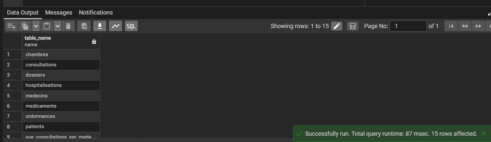
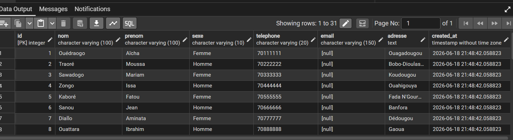
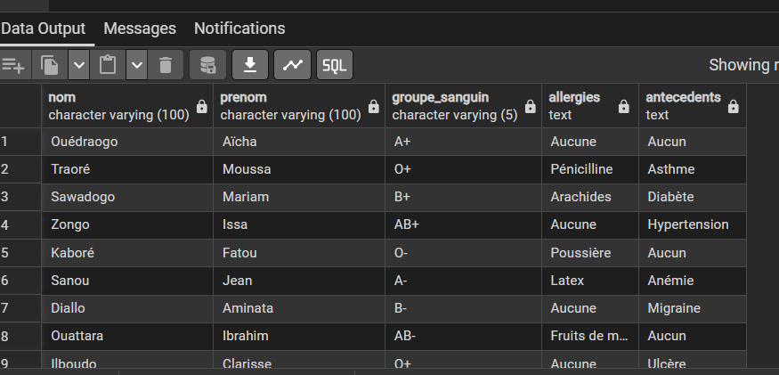

# 🏥 GestionHôpital — Projet PostgreSQL

Projet de base de données réalisé pour apprendre et maîtriser PostgreSQL .
---

## 📁 Structure du projet

```
gestion-hopital/
├── 01_creation_tables.sql    → Création des 8 tables
├── 02_insertion_donnees.sql  → Insertion des données
├── 03_requetes.sql           → Requêtes SQL
└── 04_vues.sql               → Les vues (VIEWS)
```

---

## 🗄️ Schéma des relations

```
patients ───────< dossiers
    │
    └───────────< consultations >──────── medecins
                        │
                        └──< ordonnances >── medicaments

patients ───────< hospitalisations >──── chambres
```

---

## 📊 Fichier 01 — Création des tables

Ce fichier crée les 8 tables de la base de données avec leurs contraintes. Chaque table a un identifiant unique `SERIAL PRIMARY KEY` qui s'incrémente automatiquement. Les colonnes importantes ont des contraintes comme `NOT NULL` pour les champs obligatoires, `UNIQUE` pour éviter les doublons, `CHECK` pour valider les valeurs autorisées, et `REFERENCES` pour lier les tables entre elles.

Les 8 tables créées sont : `patients`, `medecins`, `chambres`, `dossiers`, `consultations`, `medicaments`, `ordonnances` et `hospitalisations`.

Les relations entre les tables sont gérées avec deux comportements :
- **ON DELETE CASCADE** → si on supprime un patient, toutes ses données liées sont supprimées automatiquement.
- **ON DELETE SET NULL** → si on supprime un médecin, la consultation reste mais le champ `medecin_id` devient NULL.



---

## 📥 Fichier 02 — Insertion des données

Ce fichier remplit les tables avec des données réalistes basées sur des noms et villes du Burkina Faso. Les données sont insérées dans un ordre précis pour respecter les relations : d'abord les tables indépendantes (`patients`, `medecins`, `chambres`, `medicaments`), ensuite les tables qui en dépendent (`dossiers`, `consultations`, `ordonnances`, `hospitalisations`).

**Volume des données insérées :**
- 10 patients · 5 médecins · 10 chambres
- 10 dossiers médicaux · 20 consultations
- 10 médicaments · 10 ordonnances · 10 hospitalisations



---

## 🔍 Fichier 03 — Requêtes SQL

Ce fichier contient toutes les requêtes pour interroger la base de données. Il couvre les `SELECT` simples, les jointures `INNER JOIN` et `LEFT JOIN` pour relier plusieurs tables, les agrégations avec `GROUP BY` et `COUNT`, les filtres avec `WHERE` et `IS NULL`, ainsi que les sous-requêtes avec `NOT IN`.

Exemples de questions auxquelles les requêtes répondent :
- Quels patients ont quel groupe sanguin et quelles allergies ?
- Quel médecin a fait le plus de consultations ?
- Quels patients sont encore hospitalisés ?
- Quels patients n'ont jamais consulté ?
- Quel est le prix moyen des médicaments ?



---

## 👁️ Fichier 04 — Les vues

Une vue est une requête sauvegardée sous un nom. Au lieu de réécrire une longue requête à chaque fois, on la crée une seule fois et on l'appelle en une seule ligne. Les vues ne stockent pas de données — elles lisent toujours les données en temps réel depuis les vraies tables.

Ce fichier crée trois vues principales :
- **vue_consultations_completes** → toutes les consultations avec le nom du patient et du médecin.
- **vue_patients_hospitalises** → les patients encore présents à l'hôpital avec leur chambre.
- **vue_stats_medecins** → le nombre de consultations par médecin, du plus actif au moins actif.


---

## 🛠️ Technologies utilisées

- **PostgreSQL** — Système de gestion de base de données relationnelle open source, utilisé pour stocker et interroger les données.
- **pgAdmin** — Interface graphique de PostgreSQL, utilisée pour exécuter les fichiers SQL et visualiser les résultats.
- **VS Code** — Éditeur de code utilisé pour écrire et organiser les fichiers SQL du projet.

---

## 👤 Auteur

**GARANE Farida Anne Kevine**  
Projet d'apprentissage PostgreSQL 